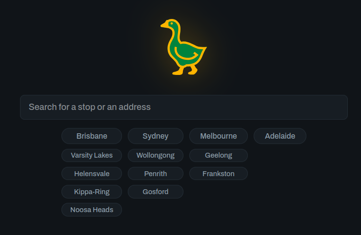
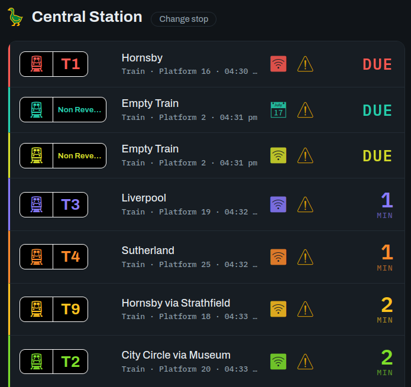
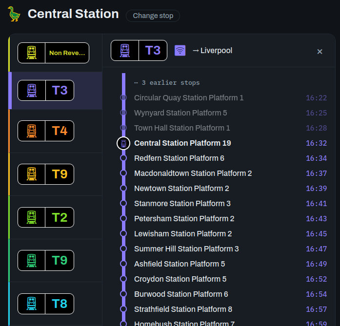
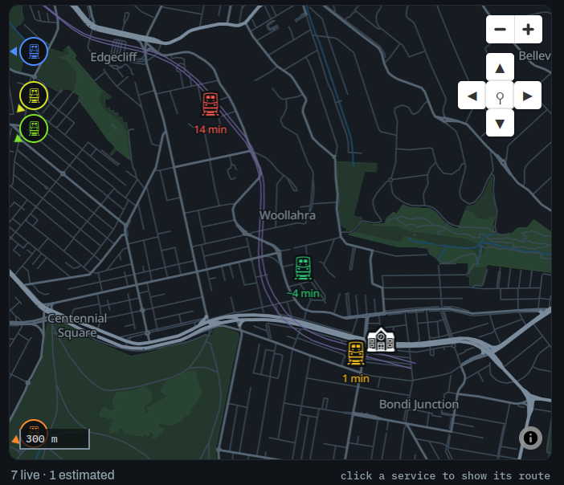

# Next Service — a live departures board for Brisbane, Melbourne, Sydney, Adelaide, Perth, Darwin & regional Queensland

A "next service arriving in X minutes" board with a live map, for any public
transport stop in **Queensland (Translink — South East Queensland plus
eighteen regional town networks, Cairns to Warwick)**, **Victoria (PTV +
V/Line)**, **Sydney (TfNSW)**, **South Australia (Adelaide Metro)**,
**Western Australia (Transperth/PTA)** or the **Northern Territory** —
trains, metro, trams, buses and ferries. One codebase, one UI, a region switcher in the header, and a search
that spans every region (each result row carries its state). Every time on
the board is the network's own wall clock, with the timezone (AEST, ACST,
AWST, …) badged beside the stop name.

- **Live departures board** — realtime arrival predictions overlaid on the
  timetable, refreshing every 15 s, with per-service colours that stay stable
  as the board advances. 🛜 marks a realtime prediction, 📅 timetable-only.
- **Live map** (MapLibre, fully self-hosted vector basemap) — every listed
  service is on the map: a **solid marker** where the vehicle broadcasts GPS,
  a **ghost marker** dead-reckoned from the timetable where it doesn't. Click
  a row to trace its route; click any grey stop to jump to it; zoom in past
  street level to see every stop in the network.
- **Disruption alerts** — an amber ⚠ on affected rows opens the details.
- **Find your stop** — by name, by address (auto-geocoded via a rate-limited
  Nominatim proxy), or by the *near me* button (browser geolocation; needs
  HTTPS off-localhost).
- **The board and the map always agree**: a service is listed only if it can
  be placed on the map (live GPS, en route per the timetable, or about to
  depart its origin).

## Screenshots  
  







  
## Regions

| Region | Static GTFS | Realtime | Key needed |
| --- | --- | --- | --- |
| `seq` — Translink South East Queensland | public | TripUpdates + VehiclePositions + Alerts | none |
| `qld` — Translink regional Queensland (18 town networks merged: Cairns, Townsville, Mackay, Toowoomba, Rockhampton, Bundaberg, Hervey Bay, Gladstone, Gympie, Warwick, Bowen, Whitsundays, Innisfail, Maleny, Kilcoy, Magnetic Island + ferry, North Stradbroke Island) | public | TripUpdates + VehiclePositions + Alerts for Cairns, Bowen, Innisfail, Maryborough–Hervey Bay & Stradbroke; the rest schedule-only | none |
| `mel` — PTV Melbourne + V/Line Victoria (metro & regional train, tram, metro bus, regional coach) | public | TripUpdates + VehiclePositions + Alerts per mode | free key from [opendata.transport.vic.gov.au](https://opendata.transport.vic.gov.au/) (realtime only) |
| `syd` — TfNSW Sydney (train, metro, bus, ferry, light rail) | keyed | TripUpdates + VehiclePositions + Alerts per mode | free key from [opendata.transport.nsw.gov.au](https://opendata.transport.nsw.gov.au/) (static **and** realtime) |
| `ade` — Adelaide Metro South Australia (train, tram, bus, country coaches, Kangaroo Island ferry) | public | TripUpdates + VehiclePositions + Alerts | none |
| `per` — Transperth / PTA Western Australia (train incl. Australind, bus, ferry; regional town buses out to Broome, Carnarvon, Kalgoorlie, Esperance, Albany) | public | none published — schedule-only | none |
| `dar` — NT Transport Darwin (bus: Darwin, Palmerston, rural to Adelaide River & Kakadu) | public | none published — schedule-only | none |

Melbourne works **without** a key as a schedule-only board (arrival times from
the timetable, map positions estimated). With a key, it's fully live — set the
`MEL_*` environment variables (see `deploy/translink.container` for the exact,
verified endpoints; the auth header is `KeyID`).

Sydney needs its key even for the timetable download (`Authorization: apikey
<key>` — pass `--key` or `SYD_API_KEY` to the ingest). Realtime is the `SYD_*`
environment variables, pre-wired in `deploy/translink.container`; run
`deploy/probe-syd.sh <key>` first to confirm TfNSW's current v1/v2 endpoint
split before enabling.

Perth and Darwin publish no realtime feeds at all (the NT Bus Tracker app is
live, but its backend isn't open data), so both run as permanent
schedule-only boards: timetable arrival times, dead-reckoned ghost markers,
and a "timetable only" status line saying so.

Regional Queensland is one merged region: eighteen town networks, each a
small keyless zip on the same Translink host as SEQ's, ingested Sydney-style
under a `<town>:` prefix. Five towns have keyless realtime feeds (Cairns,
Bowen, Innisfail, Maryborough–Hervey Bay, North Stradbroke Island); services
in the other towns appear as timetable ghosts.

A region is offered in the UI once its timetable has been ingested. The API is
region-scoped under `/api/r/{region}/…`; bare `/api/…` paths alias to SEQ.

## Quick start (local, containerised)

```bash
podman build -t translink-departures .
podman volume create translink-data

# Timetables (SEQ ~1 min after download; Melbourne's zip is 292 MB;
# Sydney downloads one zip per mode and needs your TfNSW key;
# Adelaide, Perth and Darwin are one small public zip each;
# regional QLD downloads 18 small keyless zips into one merged region)
podman run --rm -v translink-data:/data translink-departures python ingest_gtfs.py
podman run --rm -v translink-data:/data translink-departures python ingest_gtfs.py --region mel
podman run --rm -v translink-data:/data -e SYD_API_KEY=<key> translink-departures python ingest_gtfs.py --region syd
podman run --rm -v translink-data:/data translink-departures python ingest_gtfs.py --region ade
podman run --rm -v translink-data:/data translink-departures python ingest_gtfs.py --region per
podman run --rm -v translink-data:/data translink-departures python ingest_gtfs.py --region dar
podman run --rm -v translink-data:/data translink-departures python ingest_gtfs.py --region qld

# Self-built vector basemaps (Planetiler, separate builder image; the first
# build downloads ~2 GB of OSM/Natural Earth sources into the cache volume)
podman build -f basemap/Containerfile -t translink-basemap .
podman run --rm -v translink-data:/data -v translink-basemap-cache:/cache translink-basemap
podman run --rm -e REGION=mel -v translink-data:/data -v translink-basemap-cache:/cache translink-basemap
podman run --rm -e REGION=syd -v translink-data:/data -v translink-basemap-cache:/cache translink-basemap
podman run --rm -e REGION=ade -v translink-data:/data -v translink-basemap-cache:/cache translink-basemap
podman run --rm -e REGION=per -v translink-data:/data -v translink-basemap-cache:/cache translink-basemap
podman run --rm -e REGION=dar -v translink-data:/data -v translink-basemap-cache:/cache translink-basemap
podman run --rm -e REGION=qld -v translink-data:/data -v translink-basemap-cache:/cache translink-basemap

podman run -d -p 8000:8000 -v translink-data:/data translink-departures
```

Open http://localhost:8000. Or, for development: `./deploy/run-local.sh
[VIC-API-KEY]` builds and runs a dev container on :8002 (key optional —
enables Melbourne realtime).

Bare-metal also works: `pip install -r requirements.txt`, `python
ingest_gtfs.py`, `uvicorn app:app --reload`. The basemap is optional — without
one the map hides and the board works unchanged.

## How it works

- `ingest_gtfs.py` loads a region's GTFS into SQLite (atomic swap, safe under
  a running server). The Melbourne adapter merges PTV's nested per-mode zips,
  prefixing ids `<mode>:` and normalising extended route types to basic GTFS;
  the Sydney adapter downloads TfNSW's separate per-mode "For Realtime" zips
  (authenticated) and merges them the same way.
- `app.py` (FastAPI) polls each region's GTFS-RT feeds in background tasks:
  TripUpdates (arrival predictions, with spec-correct **delay propagation** to
  later stops — Melbourne trams publish only the next stop or two),
  VehiclePositions (the map's solid markers) and Alerts (the ⚠ popup).
- Services without GPS get a **ghost position** interpolated along their
  scheduled stops; runs that haven't left their origin (within a 10-min
  staging window) are held off both the board and the map.
- The basemap is a self-built OpenMapTiles `.pmtiles` (Planetiler over the
  Geofabrik Australia extract), served by HTTP range requests — the page makes
  **no external requests at all** at runtime (the only exception: the optional
  server-side geocoding proxy calls Nominatim).
- `/api/feeds` exposes per-region feed health (counts, drops, staleness) for
  quick QC. `?mapdebug=1` logs per-layer rendered-feature counts.

## Deployment

CI (GitHub Actions) smoke-tests every push against a mock feed and publishes
`ghcr.io/jasonuithol/translink-departures`; the server container runs under
rootless Podman with Quadlet units (`deploy/`) and `AutoUpdate=registry`, so a
push to `main` rolls out on its own. A weekly systemd timer re-ingests the SEQ
timetable.

- `deploy/install-vps.sh` — first-time install (run as root on the VPS)
- `deploy/release-vps.sh root@host` — one local command: ship basemap + run
  the update remotely
- `deploy/update-vps.sh` — image pull, Melbourne ingest, basemap install,
  restart, health checks
- `deploy/enable-mel-vps.sh root@host KEY` — switch on Melbourne realtime
- `deploy/enable-syd-vps.sh root@host KEY` — switch on Sydney (ingest + realtime)
- `deploy/probe-syd.sh KEY` — verify every TfNSW endpoint before enabling

## Data licensing

- SEQ data © Translink / Queensland Government (CC BY 4.0 at time of writing).
- Victorian data © Department of Transport and Planning (CC BY 4.0 at time of
  writing) via the Transport Victoria Open Data portal.
- NSW data © Transport for NSW (CC BY 4.0 at time of writing) via the TfNSW
  Open Data Hub.
- SA data © Adelaide Metro / Government of South Australia (CC BY 4.0 at time
  of writing) via gtfs.adelaidemetro.com.au.
- WA data © Public Transport Authority of Western Australia via
  transperth.wa.gov.au — check the PTA's site for its current terms of use.
- NT data © Northern Territory Government (CC BY 4.0 at time of writing) via
  the NTG Open Data Portal / dipl.nt.gov.au.
- Basemap © OpenMapTiles © OpenStreetMap contributors; geocoding by
  OpenStreetMap/Nominatim.

Check each portal for current licensing and attribution requirements.

See `HANDOVER.md` for the full design log: every architectural decision, bug
post-mortem and outstanding item.
